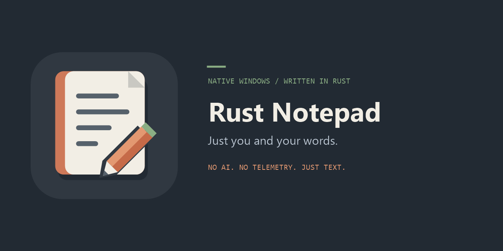

# Rust Notepad



A small, native Windows plain-text editor written in Rust. No AI, telemetry, networking, plugins, spellcheck, Markdown rendering, or browser runtime.

Released under the MIT license; see `LICENSE`.

## Run

Download the ZIP for your processor from the repository's GitHub Releases page and extract `notepad.exe`, or build from source using the instructions below. Build outputs and local test artifacts are not committed to the repository.

Run `dist\notepad.exe`, or pass one or more file paths:

```powershell
.\dist\notepad.exe "C:\notes\meeting.txt"
```

The executable is portable and uses Windows' built-in controls and dialogs. It does **not** install anything, change file associations, or replace the operating system's Notepad. Keep it in its own directory; do not copy it into Windows system directories.

Builds are available for Windows **x86 (32-bit)**, **x64**, and **ARM64 (native)**. Use ARM64 on Windows on ARM rather than the emulated x64 build. Windows 10/11 compatibility still requires the manual checks described below. The C runtime is statically linked; Rust and Visual Studio are not required to run the executable. Release binaries are currently unsigned.

## Features

- Tabs; new/open/save/save as; file drag-and-drop; multiple command-line file paths; existing-instance forwarding.
- Plain-text clipboard operations, per-tab undo/redo, literal find/replace, replace all, and logical-line navigation.
- Word wrap, font selection, zoom, line/column status, and local date/time insertion.
- Optional blue-gray dark mode for the editor, tabs, menus, status bar, and app-owned dialogs, with a saved preference.
- Native page setup and printing, including selection, page ranges, copies, and cancellation.
- UTF-8 with/without BOM, UTF-16 LE/BE with BOM, and explicit Windows ANSI import/export using the current numeric Windows code page.
- Preservation of original line endings (including mixed CRLF/LF/CR), BOM, and final-newline presence. Explicit encoding/EOL conversion is available in the menus.
- Saved and unsaved tab restoration, including selection, scroll position, and zoom.

New files use UTF-8 without BOM and CRLF. Unrecognized encodings and malformed Unicode are rejected rather than silently substituted. Use **File > Open as ANSI** for a legacy file; this can also reopen an existing tab after the usual unsaved-work prompt. Unrepresentable ANSI saves are rejected; select UTF-8 to keep the text intact.

### Dark mode

Choose **View > Dark mode** to switch between the original light appearance and a slate/blue-gray palette: `#303841` editor background, `#E8EDF2` text, muted inactive tabs, and a green unsaved-tab indicator. The preference is remembered across restarts and applies to new and restored tabs. Existing installations default to light until you enable it.

The text color stays consistent when resizing the window or changing fonts, including newly typed text.

Changing appearance does not edit text, change selection, or clear undo history. Printing uses black text on the printer's paper, even in dark mode. Windows high-contrast settings override the custom palette without clearing your saved preference. Title-bar colors are applied where supported by Windows; system file/font/print/message dialogs and native scrollbars continue to follow Windows' own appearance. No undocumented global theme hooks or system-wide color changes are used.

**Find** supports case matching, forward/backward search, and optional wrapping. It is literal text search, not regular expressions or locale-specific linguistic matching. Find/replace dialogs accept single-line terms. Columns count Unicode scalar values, rather than UTF-8 bytes or displayed character widths; an emoji counts as one column, combining marks separately.

### Keyboard shortcuts

| Action | Shortcut |
| --- | --- |
| New / Open / Save | Ctrl+N / Ctrl+O / Ctrl+S |
| Save As / Close tab | Ctrl+Shift+S / Ctrl+W |
| Next / Previous tab | Ctrl+Tab / Ctrl+Shift+Tab |
| Undo / Redo | Ctrl+Z / Ctrl+Y |
| Cut / Copy / Paste / Select all | Ctrl+X / Ctrl+C / Ctrl+V / Ctrl+A |
| Find / Replace / Go to line | Ctrl+F / Ctrl+H / Ctrl+G |
| Find next / previous | F3 / Shift+F3 |
| Date/time / Print | F5 / Ctrl+P |
| Zoom in / out / reset | Ctrl++ / Ctrl+- / Ctrl+0 |

## Saving and recovery

Closing a dirty tab prompts **Save / Discard / Cancel**. With restoration enabled, exiting the application preserves open tabs without saving their text into the original files. A checkpoint is scheduled approximately every two seconds while changes are pending; only completed checkpoints survive a crash.

Recovery and preferences live in:

```text
%LOCALAPPDATA%\RustNotepad\session.json
%LOCALAPPDATA%\RustNotepad\session.previous.json
```

These files contain document text, including unsaved text. They are **not encrypted**, not a backup service, and not securely erased by ordinary deletion. **View > Restore tabs on startup** disables restoration and removes the stored normal recovery generations. **Clear stored recovery** does the same without closing your open tabs. Once disabled, unsaved files prompt on exit.

Checkpoint failures are displayed and leave a warning in the status bar. Use **View > Write recovery checkpoint now** to retry. A failed final checkpoint cancels exit; save your files manually or resolve the storage problem. If both generations are corrupt, startup stops with their location instead of overwriting them. Preserve/copy these files before repairing or deliberately removing unusable recovery.

Clean restored tabs reopen current disk contents. Missing/unreadable files recover their snapshot as dirty text. Dirty restored tabs preserve unsaved text and require explicit confirmation before overwriting changed disk content. Undo history is deliberately not persisted across restarts.

File saves write and flush a same-directory temporary file before replacing the destination. Existing files use a recovery backup during replacement. A conflicting disk version, read-only destination, sharing violation, or other failure leaves the tab dirty and reports recoverable paths. Temporary/backup files from **failed** operations may remain at those paths for manual recovery; clearing normal session recovery does not remove such reported failure artifacts. No destructive truncate-and-write fallback is used.

This is not a guarantee against every power failure or every filesystem/provider behavior. Network shares and cloud-backed folders can have different durability semantics. The application itself makes no network requests; Windows file and printer providers can.

## Limits and implementation choices

- **20 MiB encoded size per file** on open/save; oversized input is rejected without truncation.
- **100 MiB live UTF-16 text across tabs**; at most **256 tabs**. This is not a process working-set limit. Undo, snapshots, controls, and serialization need additional memory.
- Undo text history is bounded to approximately 32 MiB per tab, retaining the latest edit even if that single edit is larger.
- Embedded NUL and native-control text transformations that cannot round-trip are rejected.
- No print preview, programmable headers/footers, session undo history, automatic updates, or large-file virtualization.
- Extremely long single lines can be much slower to lay out than ordinary line-oriented files. Word wrap and complex Unicode shaping also affect latency.

The UI uses the `windows-sys` projections from Microsoft's Rust for Windows project. A small Rust document model mirrors the native plain-text Rich Edit control, retaining original EOL metadata and transactional undo deltas. This deliberately replaces the prototype plan's native undo ownership: native undo alone cannot reliably preserve mixed line endings. Incremental native edit ranges avoid reading the whole control after normal typing; full reads remain available for bulk changes. Win32 callbacks queue events rather than reentering mutable application state during modal dialogs.

Disk writes/checkpoints run on bounded worker paths. Explicit file operations briefly disable interaction while pumping window messages; background checkpoints use immutable, revision-tagged snapshots and never clear newer changes.

## Build and checks

Prerequisites: Rustup, Microsoft Visual Studio 2022 Build Tools with the **Desktop development with C++** workload and a Windows SDK. ARM64 builds also need **MSVC v143 - VS 2022 C++ ARM64 build tools** (`Microsoft.VisualStudio.Component.VC.Tools.ARM64`). The tested x64-hosted Rust compiler is pinned in `rust-toolchain.toml`; dependencies are locked in `Cargo.lock`.

From PowerShell:

```powershell
.\scripts\build.ps1
.\scripts\build.ps1 -Test
rustup target add i686-pc-windows-msvc aarch64-pc-windows-msvc
.\scripts\build.ps1 -Architecture x86 -SmokeTest
.\scripts\build.ps1 -Architecture arm64 -SmokeTest
.\scripts\build.ps1 -Architecture arm64 -ReleaseVersion 0.1.20260928 -SmokeTest -Package
```

The script locates MSVC using `vswhere`, configures its target environment, runs formatting/lint/unit checks, verifies the PE machine type and release metadata, and copies the optimized executable into `dist\<architecture>\notepad.exe`. The default x64 build also maintains `dist\notepad.exe`. Tests execute the target's binaries: build ARM64 on an ARM64 host; x86 and x64 also run under emulation there.

`-SmokeTest` runs isolated end-to-end application tests. `-Test` adds hidden native-control/PDF checks as well; PDF checks require **Microsoft Print to PDF**. The report is `target\<Rust-target>\native-self-test.txt`. Test artifacts stay under ignored `target` directories; smoke tests use their own `LOCALAPPDATA` and never read your normal editor session.

`-ReleaseVersion 0.1.YYYYMMDD -Package` creates a ZIP and SHA-256 sidecar in `dist\packages`. The ZIP contains `notepad.exe`, `README.md`, `LICENSE`, the README banner under `resources`, and `BUILDINFO.json` with version, architecture, source commit, and executable checksum. Use a clean committed source tree for release packages.

On a Windows ARM development host, installing the pinned x64 compiler may require:

```powershell
rustup toolchain install 1.98.1-x86_64-pc-windows-msvc --force-non-host --profile minimal --component rustfmt --component clippy
```

Equivalent commands in an x64 Visual Studio developer shell:

```powershell
cargo fmt --check
cargo clippy --locked --all-targets --target x86_64-pc-windows-msvc -- -D warnings
cargo test --locked --target x86_64-pc-windows-msvc
cargo build --locked --release --target x86_64-pc-windows-msvc
.\tests\smoke.ps1
```

## Validation scope

Automated checks cover codecs and size boundaries, mixed-EOL edits/undo, safe replacement/conflicts, recovery generations, native Unicode/wrap/indexing, multipage PDF output, and the actual application lifecycle (editing, saving, tabs, orderly/crash restoration, and instance forwarding). Theme coverage includes legacy-settings compatibility, persisted light/dark toggles, native foreground/background colors, clean/dirty-state and selection preservation, high-contrast policy, and restoring screen colors after printing succeeds or fails. Test instances use a recovery-directory-specific window class as well as a session mutex, so forwarding cannot target a separately running normal editor.

The final September 28, 2026 development run used Windows 11 Enterprise 10.0.26200 on a Snapdragon X1E80100 ARM host with x64 emulation. A representative 20 MiB ASCII fixture with 80-character lines loaded into the native editor in 2.172 seconds; the measured edit/model/status pipeline had a 72 ms 95th percentile over 20 edits after optimization. A small-file launch was 201 ms. These are reference observations, not universal latency guarantees; the reproducible native report is `target\native-self-test.txt`. The lifecycle test also runs with a system-only PATH, without Rust/MSVC directories.

Separate Windows 10 and native-x64 clean-machine runs, physical-printer/copy behavior, hands-on Narrator/IME/high-contrast use, and multi-monitor DPI transitions require a manual release pass. They are not claimed as tested here. The UI uses native controls and a Per-Monitor V2 manifest to support those scenarios.

## Source layout

`src\document.rs`, `encoding.rs`, `file_io.rs`, `search.rs`, and `session.rs` hold testable state and file logic. `src\ui.rs` contains native window/control adapters and commands; `src\theme.rs` isolates display colors and native control painting; `src\printing.rs` isolates page setup and printing. The executable has no service/backend component.

### Artwork

The original copper notebook-and-pencil mark pairs the app's slate palette with warm paper and a sage-green accent. `resources\app.ico` contains transparent 16-256 pixel icons for Windows; `resources\icon.svg` and `resources\icon.png` are reusable vector and 1024-pixel versions. The README banner, `resources\social-preview.png`, is also a 1280 x 640 GitHub social-preview image.

To regenerate all artwork on Windows, run `.\scripts\generate-artwork.ps1` (PowerShell and System.Drawing; no downloaded assets or extra packages). Geometry and colors live in that script. Generated assets are committed so normal builds do not need an image tool. To use the banner for shared repository links, upload `resources\social-preview.png` in the repository's **Settings > General > Social preview**.

## Release pipeline

In GitHub, open **Actions > Release > Run workflow** and select **main**. The workflow uses the **UTC date at the start of the run** to select `0.1.YYYYMMDD` (for example, `0.1.20260928`) and tags the exact workflow commit as `v0.1.YYYYMMDD`.

Three jobs build and test in parallel: x86 and x64 on `windows-2025`, and native ARM64 on `windows-11-arm`. Every job runs formatting, strict Clippy, unit tests, and isolated application smoke tests. PDF/printer-dependent checks remain available locally via `-Test` and are not required on hosted runners. Actions are pinned to commit hashes; only the final publication job has repository write permission.

After all jobs succeed, the workflow verifies package checksums, creates a draft with all downloads, and publishes it:

```text
RustNotepad-0.1.YYYYMMDD-windows-x86.zip
RustNotepad-0.1.YYYYMMDD-windows-x64.zip
RustNotepad-0.1.YYYYMMDD-windows-arm64.zip
SHA256SUMS.txt
```

The release date is embedded in the About dialog and Windows `FileVersion`/`ProductVersion` strings. Windows' numeric four-component versions use `0.1.YYYY.MMDD`, because each numeric component is limited to 16 bits. The manifest is generated for each CPU architecture instead of hardcoding x64.

Only one version can be published per UTC day. Runs are serialized and existing dated tags are rejected rather than overwritten. A build failure produces no release. If publication is interrupted after draft creation, review the existing draft and finish publishing it rather than rerunning a workflow that would replace its tag. Source `Cargo.toml` retains the baseline package version; release builds override the display/resource version without editing tracked files.
